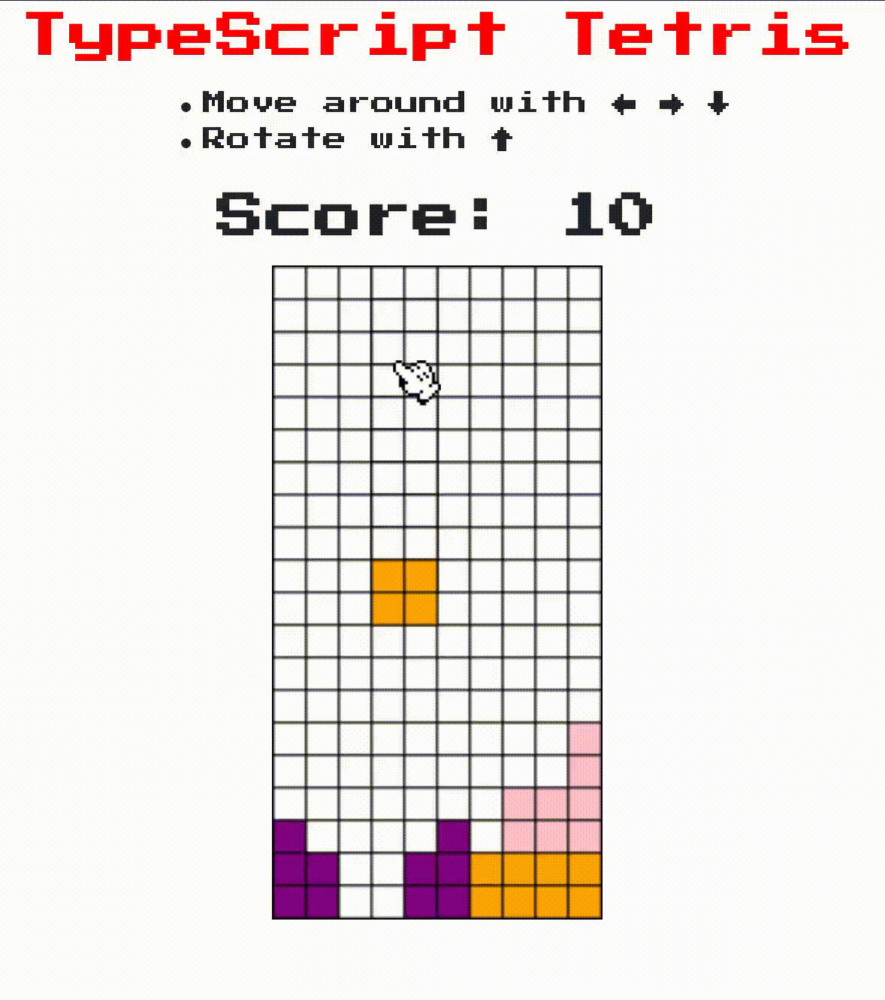

# TypeScript Tetris

## What is this?

Tsetris (TypeScript Tetris) is a clone of the popular game Tetris written in JavaScript.
The purpose of this project was for me to experiment with the TypeScript programming language.

## Demo

I implemented the most basic features of the game and it's playable [here](https://marinhero.com/tsetris/), I hope you like it!

